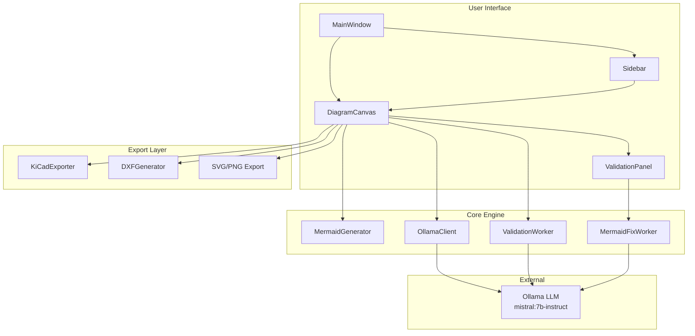
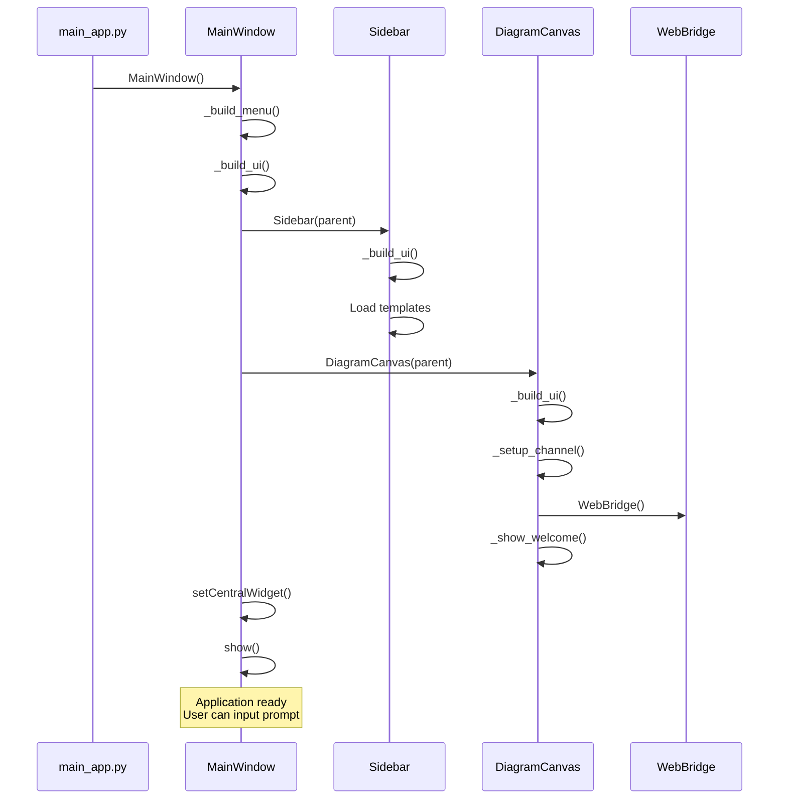
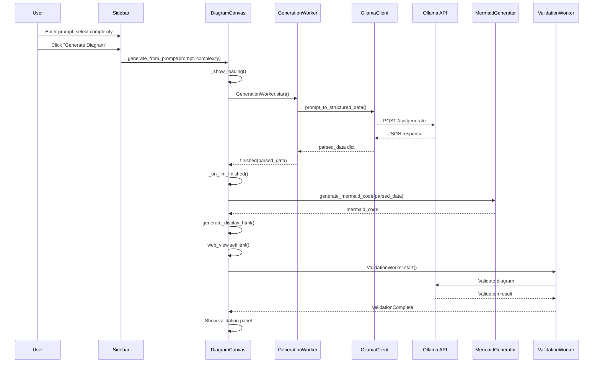
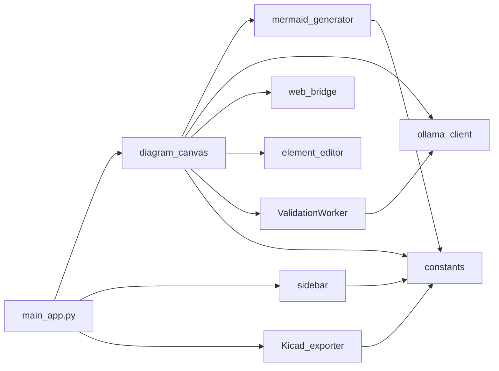
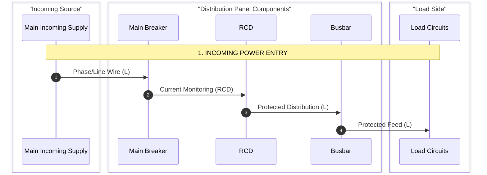

# ECD - Electrical Circuit Diagram Generator

## Project Overview

### Purpose

ECD (Electrical Circuit Diagram) is a desktop application that generates professional electrical distribution diagrams from natural language descriptions. It transforms plain English or Japanese text prompts into standardized electrical schematic diagrams using AI-powered language understanding.

### Goals

- Enable electrical engineers, electricians, and students to quickly create distribution board diagrams
- Support multiple export formats (PNG, SVG, PDF, KiCad schematic, DXF, Mermaid code)
- Provide AI-assisted validation and auto-correction of electrical diagrams
- Support bilingual operation (English and Japanese)
- Maintain electrical engineering best practices and safety standards

### Problem Solved

Electrical distribution diagrams are essential for:
- Panel building and installation
- Safety compliance documentation
- Training and education
- Maintenance and troubleshooting

Creating these diagrams manually requires specialized software and domain expertise. ECD democratizes this process by allowing users to describe systems in natural language and receive professional diagrams instantly.

### High-Level Architecture

ECD follows a **Layered Desktop Application Architecture**:

```
┌─────────────────────────────────────────────────────────────┐
│                    Presentation Layer                         │
│  ┌──────────────┐  ┌─────────────────┐  ┌────────────────┐  │
│  │   Sidebar    │  │  DiagramCanvas  │  │  MainWindow    │  │
│  │  (Input UI)  │  │   (WebView)     │  │   (Shell)      │  │
│  └──────────────┘  └─────────────────┘  └────────────────┘  │
└─────────────────────────────────────────────────────────────┘
                              │
                              ▼
┌─────────────────────────────────────────────────────────────┐
│                    Business Logic Layer                       │
│  ┌──────────────┐  ┌─────────────────┐  ┌────────────────┐  │
│  │MermaidGen    │  │  OllamaClient   │  │ValidationWorker│  │
│  │(Diagram Gen) │  │  (LLM Bridge)   │  │  (QA Engine)   │  │
│  └──────────────┘  └─────────────────┘  └────────────────┘  │
└─────────────────────────────────────────────────────────────┘
                              │
                              ▼
┌─────────────────────────────────────────────────────────────┐
│                    Integration Layer                          │
│  ┌──────────────┐  ┌─────────────────┐  ┌────────────────┐  │
│  │KiCadExporter │  │  DXFGenerator   │  │   WebBridge    │  │
│  │(CAD Export)  │  │  (CAD Export)   │  │  (Qt↔JS)       │  │
│  └──────────────┘  └─────────────────┘  └────────────────┘  │
└─────────────────────────────────────────────────────────────┘
                              │
                              ▼
┌─────────────────────────────────────────────────────────────┐
│                    External Services                          │
│  ┌──────────────────────────────────────────────────────┐   │
│  │           Ollama API (Local LLM Service)              │   │
│  │           http://localhost:11434                      │   │
│  └──────────────────────────────────────────────────────┘   │
└─────────────────────────────────────────────────────────────┘
```

### Technology Stack

| Layer | Technology |
|-------|-----------|
| GUI Framework | PySide6 (Qt 6.x Python bindings) |
| Web Rendering | QWebEngineView (Chromium) |
| Diagram Rendering | Mermaid.js 10.x |
| LLM Integration | Multi-backend: Groq Cloud API (OpenAI OSS 20B/120B), Google Gemini 3.5 Flash API, Local Ollama (Mistral 7B / Qwen 2.5 7B) + Local Regex Fallback Engine |
| Rule Verification Engine | 3-tier deterministic Python Electrical Rule Check (ERC) engine (`ERC-001` to `ERC-010`) |
| CAD & Vector Export | `ezdxf 1.4.3` (DXF with CJK font support), Matplotlib backend (PNG/PDF), SVG rendering, custom KiCad 6+ S-expression generator |
| Standalone Packaging | PyInstaller 6.x (`ECD.spec`) |
| Language | Python 3.9+ |
| Threading | QThread for async LLM generation, background validation, and auto-fix workers |

---

## System Architecture

### Architecture Diagram



### Application Startup Flow



### Request Processing Flow



### Module Dependency Diagram



---

## Repository Structure

```
ecd/
├── ECD/                          # Main application package
│   ├── main_app.py               # Application entry point, main window
│   ├── diagram_canvas.py         # Diagram rendering, interaction, fallback handling
│   ├── sidebar.py                # Input panel, model selector, templates, controls
│   ├── mermaid_generator.py      # Mermaid code generation engine & regex fallback
│   ├── erc.py                    # 3-tier deterministic Electrical Rule Check (ERC) engine
│   ├── pin_model.py              # Pin terminal layout, netlist builder & DFS wire trace
│   ├── symbols.py                # ezdxf IEC electrical symbol block library
│   ├── element_editor.py         # Dialog for editing diagram elements
│   ├── ValidationWorker.py       # Async validation + auto-fix worker
│   ├── Kicad_exporter.py         # KiCad schematic export
│   ├── dxf_generator.py          # DXF CAD export with CJK font support & SVG/PNG backends
│   ├── constants.py              # Configuration constants
│   ├── assets/
│   │   └── symbols/              # IEC SVG symbol assets (ebar, loads, maincb)
│   └── llm/                      # Multi-backend LLM Client package
│       ├── llm_factory.py        # Dynamic LLM backend factory
│       ├── groq_client.py        # Groq Cloud LLM client
│       ├── gemini_client.py      # Google Gemini 3.5 Flash LLM client
│       └── ollama_client.py      # Local Ollama client & GenerationWorker
│
├── documentation/                # Project documentation
│   ├── implementation.md         # Architecture & implementation details
│   ├── instructions.md           # Documentation standards
│   └── setup.md                  # Developer setup & build guide
│
├── tests/                        # Automated unit test suite
├── test_erc_rules.py             # Full 3-tier ERC rule test suite
├── ECD.spec                      # PyInstaller standalone build specification
└── requirements.txt              # Python package dependencies
```

### Folder Relationships

| Directory | Purpose | Interactions |
|-----------|---------|-------------|
| `ECD/` | Main application package | All modules interact through imports; `main_app` is the entry point |
| `ECD/llm/` | LLM client abstraction layer | Factory returns clients to `GenerationWorker` and `ValidationWorker` |
| `ECD/assets/` | Static runtime data files | SVG assets loaded by `mermaid_generator` |
| `documentation/` | Project documentation | Static markdown reference files |
| `tests/` | Automated test suite | Tests import core components (`erc`, `pin_model`, `mermaid_generator`) |

---

## Component Documentation

### main_app.py

**Purpose:** Application entry point and main window shell

**Responsibilities:**
- Create and manage the main application window
- Build menu bar with File, Edit, View, Help menus
- Coordinate between Sidebar and DiagramCanvas
- Handle file operations (save, export)
- Manage window state (fullscreen, zoom)

**Key Classes:**
- `MainWindow(QMainWindow)`: Main application window

**Dependencies:**
- diagram_canvas.DiagramCanvas
- sidebar.Sidebar
- Kicad_exporter.export_kicad_schematic

**Used by:** Entry point (not imported by other modules)

**Important Implementation Details:**
- Uses `QWebEngineView` for diagram rendering
- Event filter handles ESC key to exit fullscreen
- All exports check for valid diagram before proceeding

```python
# Entry point
def main():
    app = QApplication(sys.argv)
    app.setStyle("Fusion")
    win = MainWindow()
    win.show()
    sys.exit(app.exec())
```

---

### diagram_canvas.py

**Purpose:** Core diagram rendering and interaction hub

**Responsibilities:**
- Render Mermaid diagrams in WebView
- Coordinate LLM calls for generation
- Handle element editing (double-click)
- Manage validation workflow
- Export to PNG, SVG, PDF
- Store current diagram state
- **Expose fallback state visually**: Prevent silent fallback when Groq/Gemini calls fail (429 rate limits, API offline) by displaying "Regex Fallback" in the status bar and injecting a warning in the validation findings panel.

**Key Classes:**
- `DiagramCanvas(QWidget)`: Main rendering widget
  - `generate_from_prompt()`: Async diagram generation
  - `_run_validation()`: Start validation worker
  - `_on_validation_complete()`: Post-process results and inject fallback warning banner if `self._is_regex_fallback` is active.
  - `export_svg()`, `export_svg_as_png()`: Export methods
  - `refresh_diagram()`: Re-render after edits

**Dependencies:**
- mermaid_generator.MermaidGenerator
- llm.llm_factory.get_llm_client
- web_bridge.WebBridge
- element_editor.ElementEditorDialog
- ValidationWorker.ValidationWorker, ValidationPanel, MermaidFixWorker

**Used by:** MainWindow

**State Management:**
- `current_parsed_data`: Active diagram data
- `original_parsed_data`: Pre-edit state for reset
- `_current_mermaid_code`: Live Mermaid code
- `_validation_worker`: Background validation thread
- `_gen_worker`: Background generation thread
- `_fix_worker`: Background auto-fix thread
- `_is_regex_fallback`: Boolean tracking if the fallback regex parser was used due to LLM failure

**Critical Flow - Async Generation with Fallback handling:**
```python
def generate_from_prompt(self, prompt_text, complexity_level="Neutral"):
    # 1. Reset fallback status and show loading screen
    self._is_regex_fallback = False
    self._show_loading()
    
    # 2. Start background worker
    self._gen_worker = GenerationWorker(prompt_text, complexity_level, self.generator)
    self._gen_worker.finished.connect(self._on_llm_finished)
    self._gen_worker.failed.connect(self._on_llm_failed)  # Triggers regex fallback and sets _is_regex_fallback = True
    self._gen_worker.start()
    
    # 3. Return immediately (non-blocking)
    return True
```

---

### sidebar.py

**Purpose:** User input panel with controls and templates

**Responsibilities:**
- Provide text input for diagram description
- Complexity level selection (Simple, Neutral, Standard, Detailed)
- Quick-start templates
- Generate and Reset buttons
- Collapsible panel UI

**Key Classes:**
- `Sidebar(QWidget)`: Left panel widget

**Dependencies:**
- constants.COMPLEXITY_LEVELS

**Used by:** MainWindow

**Templates:**
- Basic Distribution
- Industrial Panel
- Residential Board
- Three-Phase System
- Safety Earth System
- 日本語: 基本的な配電 (Japanese)

---

### mermaid_generator.py

**Purpose:** Generate Mermaid sequence diagram code from structured data

**Responsibilities:**
- Parse natural language prompts (regex fallback)
- Generate Mermaid.js sequence diagram code
- Create HTML display with embedded Mermaid
- Support bilingual output (English/Japanese)
- Apply complexity-level filtering

**Key Classes:**
- `MermaidGenerator`: Core generation engine
  - `parse_prompt()`: Regex-based prompt parsing (fallback)
  - `generate_mermaid_code()`: Generate sequenceDiagram code
  - `generate_display_html()`: Create full HTML page
  - `detect_language()`: English/Japanese detection

**Dependencies:**
- constants.COMPLEXITY_LEVELS

**Used by:** DiagramCanvas

**Component Mapping:**
```python
self.components_map = {
    "main incoming supply": {"en": "Main Incoming Supply<br/>(230V / 415V)", "ja": "主電源<br/>(230V / 415V)"},
    "main breaker": {"en": "Main Breaker<br/>(MCB/MCCB)", "ja": "主遮断器<br/>(MCB/MCCB)"},
    "rcd": {"en": "RCD<br/>(Earth Fault Protection)", "ja": "漏電遮断器<br/>(RCD/RCBO)"},
    # ... etc
}
```

**Complexity Handling:**
- **Simple**: Only Phase (L) wire, no neutral/earth
- **Neutral**: Prompt-driven only, no defaults
- **Standard**: Full L/N/E with RCD, no fault paths
- **Detailed**: Complete diagram with fault paths and protection notes

---

### erc.py (Electrical Rule Check Engine)

**Purpose:** Three-tier deterministic Python validation engine to verify electrical design rules independently of wire graph continuity (`validate_netlist()`) and LLM semantic review.

**Responsibilities:**
- Run 10 deterministic rules (`ERC-001` through `ERC-010`, including `ERC-003b`) against `netlist` and `parsed_data`.
- Evaluate rules in parallel without short-circuiting so all findings surface in a single pass.
- Return structured `ERCFinding` instances with code, severity (`ERROR` or `WARNING`), message, and affected component IDs.

**Rule Tiers:**
- **Tier 1 — Presence Rules**:
  - `ERC-001`: Single supply constraint (exactly 1 supply per diagram).
  - `ERC-002`: Main breaker presence (`maincb` or top-of-column `rcbo`).
  - `ERC-003`: Earth bar presence (`ebar` required in Standard/Detailed).
  - `ERC-003b`: Neutral bar presence (`nbar` required in Standard/Detailed).
  - `ERC-004`: Earth fault protection (`rcd`/`rcbo` required in Standard/Detailed).
- **Tier 2 — Consistency Rules**:
  - `ERC-005`: Surfaces voltage/phase mode overrides and inferences transparently.
  - `ERC-006`: Phase mode component compatibility (flags 3-phase components in single-phase mode).
  - `ERC-007`: Unprotected load direct connection (L-net walk verifying all loads pass through protective devices).
- **Tier 3 — Topology Sanity Rules**:
  - `ERC-008`: Wiring graph cycle detection (iterative DFS path-stack checking for feedback loops).
  - `ERC-009`: Orphaned component detection (declared components with zero netlist connections, mapping `"loads"` placeholder to expanded `load_N` children).
  - `ERC-010`: Duplicate / colliding component IDs (exact string duplicates + singleton base type normalization).

**Used by:** `DiagramCanvas` (via `ValidationWorker`), `test_erc_rules.py` test suite.

---

### pin_model.py

**Purpose:** Pin-level terminal geometry, netlist generation, and graph wire-continuity tracing.

**Responsibilities:**
- Define terminal pin maps for all component types (`supply`, `maincb`, `rcd`, `bus`, `nbar`, `ebar`, `loads`, `motor_3ph`, etc.).
- Compute physical 2D coordinates (`compute_component_positions()`) for CAD layouts.
- Generate graph netlist (`generate_netlist()`) with L, N, E wire connections.
- Perform DFS wire continuity tracing (`validate_netlist()`) verifying continuous L/N/E paths from supply to load input terminals.
- Resolve phase mode (`determine_phase_mode_detailed()`) returning mode, reason code, and description.

**Used by:** `dxf_generator.py`, `erc.py`, `DiagramCanvas`, `verify_pin_model.py`.

---

### symbols.py

**Purpose:** ezdxf block library for standard IEC electrical symbols.

**Responsibilities:**
- Register reusable DXF block symbols (`SYM_BREAKER`, `SYM_MCB`, `SYM_RCD`, `SYM_LAMP`, `SYM_GROUND`, `SYM_JUNCTION`, `SYM_GENERIC`, `SYM_SUPPLY_3PH`, `SYM_BREAKER_3PH`, `SYM_RCD_3PH`, `SYM_BUSBAR_3PH`, `SYM_MOTOR_3PH`).
- Define exact terminal pin attachment offsets for DXF wiring alignment.

**Used by:** `dxf_generator.py`.

---

### ECD/llm/ (LLM Clients & Factory)

**Purpose:** Multi-backend LLM parsing and schema-structured generation.

**Responsibilities:**
- Provide client interfaces for **Ollama** (offline local), **Groq** (cloud), and **Gemini** (cloud) backends.
- Use a central factory (`llm_factory.py`) to resolve active client based on `ECD_LLM_BACKEND` environment variable.
- Enforce strict JSON schema-structured outputs from external APIs.

**Key Classes & Modules:**
- `llm_factory.get_llm_client()`: Returns the active `LLMClientBase` implementation.
- `OllamaClient`: Local offline client targeting `mistral:7b-instruct`.
- `GroqClient`: High-speed cloud client targeting `openai/gpt-oss-20b`.
- `GeminiClient`: Google AI Studio cloud client targeting **`gemini-3.5-flash`** (with a high-allowance token limit of `4096` to prevent truncation of thinking outputs).

**Used by:** DiagramCanvas (via `GenerationWorker` thread), ValidationWorker, MermaidFixWorker

### ValidationWorker.py

**Purpose:** Validate diagrams and auto-fix issues

**Responsibilities:**
- Run LLM-based diagram validation
- Parse validation findings
- Auto-correct diagrams using LLM
- Display validation results in panel

**Key Classes:**
- `ValidationWorker(QThread)`: Background validator
  - Takes prompt, mermaid_code, complexity
  - Returns validation status and findings

- `MermaidFixWorker(QThread)`: Auto-fix worker
  - Takes current code, findings, prompt
  - Returns corrected Mermaid code

- `ValidationPanel(QWidget)`: UI for validation results
  - Shows loading, success, or issues
  - "Fix Issues" button triggers auto-fix

**Validation Logic:**
```python
# Complexity-aware validation
complexity_context = {
    "Simple": "Only Phase (L) wire is shown. No neutral/earth.",
    "Neutral": "Only validate what user explicitly described.",
    "Standard": "No fault paths expected. Validate L/N/E connectivity.",
    "Detailed": "Validate everything strictly."
}
```

**Used by:** DiagramCanvas

---

### web_bridge.py

**Purpose:** Bridge between Qt and JavaScript in WebView

**Responsibilities:**
- Receive events from JavaScript
- Emit Qt signals for Python handlers
- Enable bidirectional communication

**Key Classes:**
- `WebBridge(QObject)`: Qt bridge object
  - `onElementDoubleClicked`: Slot called from JS
  - `onElementEdited`: Slot called from JS
  - `onDiagramTextChanged`: Slot called from JS

**Signals:**
```python
elementDoubleClicked = Signal(str, str, str)  # element_id, element_type, current_text
elementEdited = Signal(str, str, str, float, float)  # id, type, text, x, y
diagramChanged = Signal(str)  # new_mermaid_code
```

**Used by:** DiagramCanvas

---

### Kicad_exporter.py

**Purpose:** Export diagrams as KiCad 6+ schematics

**Responsibilities:**
- Convert parsed_data to KiCad S-expression format
- Generate inline lib_symbols
- Place components and wires
- Create valid .kicad_sch files

**Key Functions:**
- `export_kicad_schematic(parsed_data, file_path)`: Main entry point
- `normalize_components()`: Map conceptual IDs to KiCad IDs
- `_build_schematic()`: Generate schematic body
- `_serialise()`: Create complete file content

**Component Mapping:**
| Conceptual ID | KiCad ID |
|--------------|----------|
| supply | supply_L, supply_N, supply_PE |
| maincb | maincb |
| outcb_N | outcb |
| loads | outcb + load pairs |
| rcd, bus, nbar, ebar | Absorbed (topology only) |

**Used by:** MainWindow

---

### dxf_generator.py

**Purpose:** Export diagrams as DXF CAD files

**Responsibilities:**
- Create DXF documents with ezdxf
- Draw component boxes and wires
- Apply color coding (Phase=Red, Neutral=Blue, Earth=Green)
- Add title block and legend

**Key Functions:**
- `export_dxf(parsed_data, output_path)`: Main export function
- `mermaid_to_dxf(mermaid_code, output_path)`: Direct Mermaid conversion
- `parse_mermaid_sequence()`: Extract nodes/edges from Mermaid

**Drawing Constants:**
```python
BOX_W = 60       # Component box width (mm)
BOX_H = 20       # Component box height (mm)
V_GAP = 18       # Vertical gap between boxes
COL_PHASE = colors.RED
COL_NEUTRAL = colors.BLUE
COL_EARTH = colors.GREEN
```

**Used by:** MainWindow (via Test2.py integration)

---

### constants.py

**Purpose:** Centralized configuration constants

**Responsibilities:**
- Define complexity level configurations
- Store component visibility flags
- Provide descriptions for UI

**Key Data:**
```python
COMPLEXITY_LEVELS = {
    "Simple": {
        "components": ["supply", "maincb", "loads"],
        "show_neutral": False,
        "show_earth": False,
        "show_rcd": False,
        "show_fault_paths": False,
    },
    "Neutral": {
        "components": [],  # Prompt-driven only
        # ...
    },
    "Standard": {
        "components": ["supply", "maincb", "bus", "nbar", "ebar", "rcd", "loads"],
        "show_neutral": True,
        "show_earth": True,
        "show_rcd": True,
    },
    "Detailed": {
        "components": ["supply", "maincb", "bus", "rcd", "nbar", "ebar", "loads"],
        "allow_outcb": True,
        "show_fault_paths": True,
        "show_protection_notes": True,
    },
}
```

**Used by:** All modules (imported for configuration)

---

## Runtime Lifecycle

### Startup

1. **Module Loading**
   - Python imports all modules
   - Qt resources initialized
   - WebEngine initialized

2. **Window Creation**
   - MainWindow instantiated
   - Menu bar built
   - UI layout constructed

3. **Component Initialization**
   - Sidebar created with templates
   - DiagramCanvas created with WebView
   - WebBridge registered with WebChannel
   - ValidationPanel created (hidden)

4. **Display**
   - Welcome HTML shown in WebView
   - Window shown to user
   - Status bar displays ready message

### Runtime

1. **User Input**
   - User enters prompt in sidebar
   - Selects complexity level
   - Clicks "Generate Diagram"

2. **Generation**
   - Loading screen shown
   - Background thread calls LLM
   - MermaidGenerator creates code
   - WebView renders diagram
   - Validation starts in background

3. **Editing**
   - User can drag boxes (JavaScript)
   - Double-click opens editor dialog
   - Code can be edited directly

4. **Export**
   - User selects export format
   - Appropriate exporter called
   - File saved to disk

### Shutdown

1. User closes window or presses Ctrl+Q
2. `closeEvent` triggered on DiagramCanvas
3. Background workers stopped if running
4. Qt event loop exits
5. Application terminates

---

## Business Logic

### Prompt Parsing

The application uses a **two-tier parsing strategy**:

1. **LLM Parsing (Primary)**
   - Sends prompt to Ollama with structured instructions
   - LLM returns JSON with components, flags, voltage, language
   - Provides semantic understanding of user intent

2. **Regex Parsing (Fallback)**
   - Triggered when LLM unavailable
   - Uses keyword matching in multiple languages
   - Extracts voltage with regex patterns
   - Provides basic component detection

### Complexity Level System

| Level | Components | Wires Shown | Use Case |
|-------|-----------|-------------|----------|
| Simple | supply, maincb, loads | L only | Basic concept diagrams |
| Neutral | Prompt-defined | Prompt-defined | Maximum flexibility |
| Standard | supply, maincb, bus, nbar, ebar, rcd, loads | L, N, E | Professional diagrams |
| Detailed | Standard + outgoing MCBs | L, N, E + fault paths | Complete documentation |

### Component ID System

The system uses semantic component IDs:

| ID | Meaning | Label (EN) |
|----|---------|-----------|
| supply | Incoming mains | Main Incoming Supply |
| maincb | Main circuit breaker | Main Breaker (MCB/MCCB) |
| rcd | Residual current device | RCD (Earth Fault Protection) |
| bus | Distribution busbar | Busbar (Distribution) |
| nbar | Neutral bar | Neutral Bar |
| ebar | Earth bar | Earth Bar |
| outcb_N | Nth outgoing MCB | Outgoing MCB #N |
| loads | Load circuits | Load Circuits |

### Mermaid Diagram Generation

The MermaidGenerator creates **sequenceDiagram** output:



---

## Data Model

### Parsed Data Structure

```python
parsed_data = {
    "components": [
        ("supply", "Main Incoming Supply<br/>(230V / 415V)"),
        ("maincb", "Main Breaker<br/>(MCB/MCCB)"),
        ("rcd", "RCD<br/>(Earth Fault Protection)"),
        ("bus", "Busbar<br/>(Distribution)"),
        ("nbar", "Neutral Bar"),
        ("ebar", "Earth Bar"),
        ("loads", "Load Circuits<br/>(Lights, Sockets)")
    ],
    "flags": {
        "show_neutral": True,
        "show_earth": True,
        "show_rcd": True,
        "show_protection_notes": False,
        "show_fault_paths": False
    },
    "voltage": "230V / 415V",
    "language": "en",
    "complexity": "Standard",
    "prompt": "Original user prompt text"
}
```

### Component Tuple Format

```python
(component_id: str, label: str)
```

- `component_id`: Semantic ID (supply, maincb, rcd, bus, nbar, ebar, outcb_N, loads)
- `label`: Display text (may include HTML `<br/>` for line breaks)

---

## API Documentation

### Internal APIs

#### LLMClientBase.prompt_to_structured_data() (Implemented by OllamaClient, GroqClient, GeminiClient)

```
Purpose: Parse natural language prompt into structured data matching the strict JSON schema
Method: HTTP POST to the respective LLM API endpoint (local/cloud)
Endpoint: 
  - Ollama: http://localhost:11434/api/generate
  - Groq: https://api.groq.com/openai/v1/chat/completions
  - Gemini: https://generativelanguage.googleapis.com/v1beta/models/...

Parameters:
  - prompt (str): User's diagram description
  - complexity (str): "Simple", "Neutral", "Standard", or "Detailed"

Returns:
  - dict: {
      "components": [(id, label), ...],
      "flags": {show_neutral: bool, ...},
      "voltage": str,
      "language": "en" | "ja",
      "phase_hint": str
    }

Raises:
  - requests.HTTPError: API request failed
  - ValueError: Invalid JSON response
```

#### MermaidGenerator.generate_mermaid_code()

```
Purpose: Generate Mermaid sequenceDiagram code from parsed data
Parameters:
  - parsed_data (dict): Structured component data

Returns:
  - str: Complete Mermaid sequenceDiagram code
```

#### export_kicad_schematic()

```
Purpose: Export diagram as KiCad schematic
Parameters:
  - parsed_data (dict): Structured component data
  - file_path (str): Output .kicad_sch path

Returns: None (writes file)

Raises:
  - ValueError: Invalid component data
  - IOError: File write failed
```

---

## Configuration

### Environment Variables

None required. Ollama API URL is hardcoded but can be modified in ollama_client.py.

### Configuration Files

No external configuration files. All configuration in code:

- `constants.py`: Complexity level definitions
- `ollama_client.py`: LLM model and API URL
- `ValidationWorker.py`: Validation parameters

---

## Design Decisions

### Why PySide6 + WebEngine?

- **Rich text rendering**: Mermaid.js handles complex diagram rendering
- **JavaScript ecosystem**: Leverage Mermaid.js maturity
- **Cross-platform**: Qt provides native feel on all platforms
- **Async operations**: Qt signals/slots handle async cleanly

### Why Sequence Diagrams?

Mermaid sequence diagrams were chosen because:
- Natural fit for electrical flow (left-to-right or top-to-bottom)
- Built-in participant boxes match electrical components
- Easy to understand for non-technical users
- Supports notes and annotations for safety information

### Why Ollama Instead of Cloud LLM?

- **Privacy**: Electrical diagrams may be proprietary
- **Reliability**: No internet dependency
- **Cost**: No API fees
- **Control**: Full control over model version

### Tradeoffs

| Decision | Benefit | Cost |
|----------|---------|------|
| Local LLM | Privacy, reliability | Requires local setup |
| Mermaid.js | Rich diagrams, easy editing | Limited customization |
| Single-window app | Simple UX | No multi-document support |

---

## Known Technical Debt

### Confirmed Issues

1. **Duplicate OllamaClient**
   - `ECD/ollama_client.py` and `Test2.py` both contain OllamaClient class
   - Test2.py appears to be a development scratchpad
   - Should consolidate into single module

2. **Monolithic mermaid_generator.py**
   - 1400+ lines in single file
   - Mixes parsing, generation, and HTML creation
   - Could be split into multiple modules

3. **Inconsistent component ID handling**
   - Multiple mappings between conceptual IDs and export IDs
   - KiCad exporter has complex normalization logic
   - Risk of divergence between exporters

### Inferred Observations

1. **diagram.py appears unused**
   - Graphics-based alternative editor
   - Does not appear in main application flow
   - Likely legacy or experimental code

2. **Sequence.py appears to be prototype**
   - Similar structure to main_app.py
   - Contains duplicate classes
   - May be development/testing version

3. **Test files in repository root**
   - Test.py, Test2.py should be in tests/ directory
   - No unit test framework in use
   - Testing appears manual/ad-hoc

4. **No logging framework**
   - Print statements used for debugging
   - Should implement proper logging

### Improvement Opportunities

1. **Add unit tests**
   - Test MermaidGenerator with various inputs
   - Test KiCad exporter output validation
   - Test prompt parsing edge cases

2. **Implement proper logging**
   - Replace print() with logging module
   - Add log levels and file output
   - Include request/response logging for LLM

3. **Extract configuration**
   - Move hardcoded values to config file
   - Support custom LLM endpoints
   - Allow user customization of templates

4. **Improve error handling**
   - More specific exception types
   - User-friendly error messages
   - Graceful degradation when LLM unavailable
